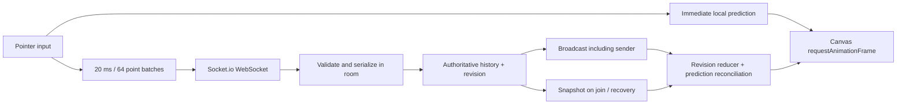

# Architecture

## Data flow

The frontend has no framework or drawing library. Vite builds vanilla TypeScript and CSS. Express serves the local build and `/health`; Socket.io handles WebSocket connection lifecycle. In the split deployment Cloudflare Pages serves the same frontend bundle. Drawing state belongs to one Node process, not to the CDN.

## Coordinates, ink, and rendering

The board uses a **1600 × 900** logical coordinate system. Its CSS box fits the viewport while retaining aspect ratio. Pointer positions convert from the canvas bounding rectangle to logical coordinates; backing dimensions scale for device pixel ratio. Resizing replays logical strokes rather than stretching previously rasterized pixels.

The visible canvas is a transparent ink surface on a separate CSS background. Brush operations use `source-over`; erasers use `destination-out`, so erasing reveals the board beneath without painting white pixels. Strokes use connected rounded paths and round single-point dots. Only active operations render, in authoritative ascending `order`.

Input is visible immediately through local prediction. Server echoes replace provisional order and contribute authoritative points; the renderer merges a pending stroke's point tail with the authoritative prefix by stroke ID, never draws two copies. Completion removes its prediction. Pointer cancellation removes local pending input and asks the server to cancel the unfinished operation.

Canvas rendering uses one dirty `requestAnimationFrame`. Stable completed prefixes are cached, and updates repaint only dirty logical regions from that prefix before replaying later operations in begin order. A changing unfinished stroke can require replay of later operations, including erasers. Long contiguous runs of completed brush strokes in the live tail are rasterized once into a reusable image; erasers and short or mixed runs remain ordered operations so `destination-out` compositing is deterministic. Cached paths and rasters are invalidated by geometry/style changes, removals, history changes, and device-pixel-ratio changes. Remote cursors are lightweight DOM elements over the board; cursor movement does not redraw ink. Their percentage coordinates use the same logical board bounds, and stale indicators expire.

## Wire contract

All payload types live in `shared/protocol.ts`. The backend runtime-validates untrusted commands; TypeScript alone does not validate network input.

| Event | Direction | Payload / behavior |
| --- | --- | --- |
| `room:join` | client → server | `{roomId,name}` plus result acknowledgement |
| `room:snapshot` | server → joining/resyncing client | `{epoch,revision,roomId,selfId,strokes,redoIds,users}`; includes unfinished strokes |
| `room:resync` | client → server | Requests another authoritative snapshot |
| `command` | client → server | One of the discriminated commands below, with `{ok:true}` or `{ok:false,error}` acknowledgement |
| `drawing:event` | server → room, including sender | `{epoch,revision,change}` accepted authoritative change |
| `presence:update` | server → room | Current list of `{id,name,color}` |
| `cursor:update` | both | Client `{x,y}` or null; server `{userId,point}` |
| `server:error` | server → client | Human-readable protocol/capacity feedback |

Commands are `stroke:begin` (`id,tool,color,width,point`), `stroke:points` (`id,offset,points`), `stroke:end` (`id`), `stroke:cancel` (`id`), `history:undo`, and `history:redo`. Author identity and visual/completion order come from the server, never the request.

Each begin creates point index 0. Subsequent point batches declare their starting **offset**, initially 1. Exact repeated batches are acknowledged without changing points or revision. Conflicting duplicates, gaps, invalid coordinates, and unauthorized edits are rejected. End is idempotent for a completed operation. There is no retransmit queue for offline drawing.

## Ordering and shared undo/redo

The Node event loop applies commands serially within a room. Every accepted drawing mutation increments the room's drawing revision exactly once; cursor/presence messages do not consume revisions.

There are two intentionally separate orders:

1. **Visual order** is assigned at stroke begin. If A begins, B begins an eraser, then more A points arrive, A remains below B. All clients replay A then B regardless of packet timing.
2. **Completion order** is assigned at stroke end. Undo selects the active completed operation with greatest completion order, regardless of the requester or author. Unfinished strokes cannot be undone.

Undo marks that operation inactive and pushes its ID on a shared redo stack. Redo pops and reactivates it at its original visual position and original completion order. New completion clears the redo stack and discards the invalidated inactive operations. Server tombstones prevent reuse of previously accepted IDs. Simultaneous history commands are serialized just like drawing commands.

No pixel subtraction or inverse eraser is needed: history changes invalidate a cached prefix and the renderer reconstructs the correct composited result. For example, undoing an eraser naturally restores the strokes beneath it.

## Recovery and late join

Socket.io preserves ordering during a connection, but disconnections require application-level recovery; its default delivery semantics do not restore missed events. See [Socket.io delivery guarantees](https://socket.io/docs/v4/delivery-guarantees/).

The client does not enable drawing until a snapshot is hydrated. The reducer can buffer reliable same-epoch events for direct recovery tests, while the Socket.io boundary drops drawing packets during connection or snapshot hydration because the authoritative snapshot covers that interval. Snapshot hydration replaces authoritative state, discards events covered by the snapshot revision, then applies newer same-epoch events exactly once. A revision gap or unexpected epoch pauses input and requests a new snapshot. The buffer is bounded; overflow also forces resynchronization. A hydration timeout reconnects instead of waiting indefinitely.

Snapshots are constructed and emitted synchronously in the room's serialized event loop. Other room mutations occur before or after this snapshot boundary. The revision identifies that boundary even while other users continue drawing.

On disconnect the browser discards pending batches and predictions; the server cancels every unfinished operation owned by that connection when it detects departure. Completed history stays in memory. Reconnect uses jittered exponential backoff and a fresh snapshot with a fresh connection identity. No local drawing is replayed. Resync during a gesture also abandons it; any unfinished operation owned by that same connection is canceled after hydration.

Every room lifetime has a new random epoch. Restarting the process or recreating an expired room changes it. Returning clients show a session-reset message. This is honest loss of ephemeral state, not a fabricated recovery from persistence.

## Validation and bounded resources

The backend checks exact command shapes, safe IDs, finite coordinates within the ±100,000 world, hex colors, brush/eraser tools, widths 1–64, one unfinished operation per user, batch lengths 1–64, offsets, ownership, and message size. It limits room count, participants, accepted operation IDs, history size, points, total points, image bytes, and command rates. Empty rooms expire after 30 minutes. Limits are configurable in the testable server factory; capacity failures do not partially mutate history.

Browser origins use an exact allowlist. Origin checks are a browser cross-site protection, **not authentication**: a native client can omit/spoof Origin. This public-room MVP has no private board guarantee. Production should terminate TLS at the host and use an explicit frontend origin. Slow/disconnected peers must recover through snapshots instead of retaining an unbounded transport queue.

## Performance and scaling

- Batched point messages (20 ms / 64 samples) bound per-message overhead and flush on release.
- Input prediction hides network round-trip delay for the author; authoritative echoes settle ordering.
- Immutable changed stroke objects let the canvas cache identify invalidation; unchanged prefixes avoid repeatedly rasterizing older history.
- Dirty-region repaint and reusable long brush-run rasters reduce repeated full-surface and path work while preserving ordered eraser replay. Opt-in diagnostics report pointer-to-render, frame, batching, reducer, acknowledgement, and repaint metrics locally; they send no telemetry.
- Cursor messages are throttled, volatile, and separate from drawing revisions.
- Memory and history caps bound this MVP. Snapshot cost grows with stored points, so this is deliberately not an infinite archive.

`docs/VERIFICATION.md` records measured local propagation and browser results. Local socket measurements are not international latency measurements; WebKit automation on Windows is not native Safari certification.

One Render instance in Singapore prioritizes the planned India/Asia audience. Cloudflare's CDN improves initial page delivery but does not remove cross-country drawing latency. A future scaled service would assign each room a single owner, persist an operation log plus snapshots, and route clients to that owner. Simply increasing independent backend instances would split authority and corrupt collaboration. Persistent server storage, Redis, multi-region routing, and paid infrastructure remain outside this MVP.

## Document v2 additions

The shared document union covers ink, shapes, text, and image references. DOM-free command application produces before/after transactions for local and server authority alike; mixed legacy rooms promote to transaction history when their first object edit is accepted. Images stay out of drawing events and snapshots and use token-authenticated, bounded PNG/JPEG/WebP endpoints.

Saved canvases use IndexedDB with separate file and asset stores, best-effort single-writer exclusion, one-second idle autosave, and a five-second continuous-edit ceiling. Project downloads embed versioned JSON and base64 image bytes. Managed host sessions carry a private capability, host-save watermark, two-minute host recovery pause, and explicit end state; invite URLs never carry the capability.

The camera maps a bounded ±100,000 world through a 10–400% viewport transform. Space/middle-button/Hand navigation, wheel zoom, two-finger touch navigation, object hit-testing, marquee selection, leases, and ink-only erasing are interaction layers and do not consume camera revisions. The latency label uses independent ten-second Socket.IO acknowledgement probes and reports the median of the latest five samples.
