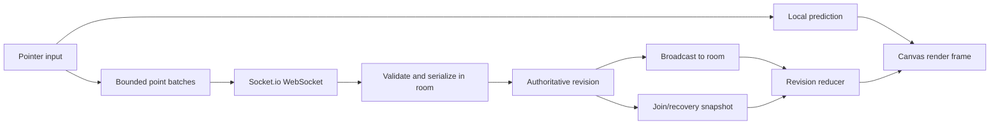

# Architecture

## Runtime flow

The frontend is framework-free TypeScript and CSS. Vite builds the client. Express serves the built client and `/health`; Socket.io owns the live connection. In production, Cloudflare Pages distributes the same client bundle while one Node process remains authoritative for each room.

## State and wire contract

`shared/protocol.ts` contains the discriminated wire types and `shared/document.ts` contains document validation and transaction application. The server validates every untrusted payload at runtime; TypeScript types are not a security boundary.

The server assigns a room epoch, monotonically increasing revision, stroke start order, and stroke completion order. A `room:snapshot` is authoritative for its epoch and revision. A `drawing:event` advances exactly one revision. The client reducer rejects gaps, stale epochs, invalid offsets, and events received before hydration; it requests a snapshot when it cannot prove continuity.

Ink uses `stroke:begin`, bounded `stroke:points`, `stroke:end`, and `stroke:cancel`. Network-created ink objects are rejected; streamed strokes are the only ink mutation path. Shapes, text, images, leases, and history use document transactions. Image bytes are kept out of drawing events and are uploaded/downloaded through token-authenticated, bounded HTTP endpoints.

## Coordinates and rendering

The logical board is 1600 × 900 inside a bounded world. Pointer coordinates are derived from the CSS canvas rectangle, then transformed into logical world coordinates. The backing canvas scales for device-pixel ratio. Pan deltas are converted from CSS pixels to logical pixels, so navigation stays consistent on half-size and high-DPI displays.

Rendering preserves visual order. Ink is composited with `source-over`; erasers use `destination-out`. When a later eraser crosses an earlier brush, the earlier stroke is rendered to an isolated layer and the later eraser is applied to that layer. This prevents an eraser from removing unrelated objects or ink that appears later in the order. Stable completed prefixes and long brush runs are cached, while mixed or eraser-sensitive ranges replay in order.

Shapes, text, and images remain document objects above the transparent ink surface. Image objects render only after their decoded asset is available. PNG export performs an independent content-sized pass, waits for fonts, applies the same ordered eraser rules, and refuses to produce a misleading image when a referenced asset is not decoded.

## Collaboration and recovery

Input is predicted immediately, then replaced by authoritative server echoes. Pending batches are discarded on disconnect; offline drawing is never queued. Socket reconnects use a fresh identity and snapshot, and stale packets from the previous transport lifetime are ignored.

Managed host rooms have a private host capability, a host-save watermark, and a bounded recovery pause. The host remains disabled until the saved document and retained assets have been restored and the server has accepted a current save. A failed or delayed restore preserves the immutable local recovery source, blocks local mutation and host acknowledgement, and exposes retry/error state. A newer server revision is accepted during recovery so a guest change cannot be overwritten by an older local file when host metadata has not yet been autosaved.

Shared undo/redo is serialized by the server and follows completion order. If another participant holds an active object-edit lease, shared history mutation is rejected rather than silently invalidating that edit. Object rename/edit actions remain inside the editor, where the current writer and save path are known; the home screen only operates on durable file records.

## Persistence and safety boundaries

Local files use IndexedDB file and asset stores with single-writer best effort. Saves validate the document, reject duplicate assets, and reject any referenced asset whose bytes are absent or empty before changing the previous snapshot. Project downloads include versioned JSON and base64 asset bytes.

The server applies limits for rooms, participants, command rates, operation IDs, history, points, document objects, asset bytes, and message size. Persistence snapshots are atomic JSON files containing validated completed room state and assets. Without `PERSISTENCE_PATH`, rooms are ephemeral by design. Origin allowlisting protects browser cross-site access but does not authenticate native clients or make a public room private.

## Deployment and rollback

Render runs `npm ci --include=dev && npm run build`, then `node dist/server/server/index.js`, with `/health` as the health check. Cloudflare Pages runs `npm ci && npm run build` and publishes `dist/client`; its build-time `VITE_SERVER_URL` must point to the deployed backend.

Release the backend first, verify health, origin handling, WebSocket join, host recovery, and asset endpoints, then publish the frontend. Keep the prior Render deployment URL and Pages preview until hosted smoke checks pass. Roll back the frontend to the previous Pages deployment and restore the previous backend deployment if a smoke check exposes a regression. Do not change production environment values during rollback unless the previous release requires them.

## Known limitations and scaling path

This is a bounded single-authority MVP: there is no account system, private-board authorization, offline queue, pressure sensitivity, or native Safari certification. Browser IndexedDB is user-controlled storage and should be backed up with project downloads. A sleeping free backend can delay reconnects.

Scaling requires assigning each room one owner, persisting an operation log plus snapshots, and routing clients to that owner. Multiple independent application instances without shared room authority would split revisions and corrupt collaboration. Redis, external asset storage, multi-region routing, and paid infrastructure are outside this release.
